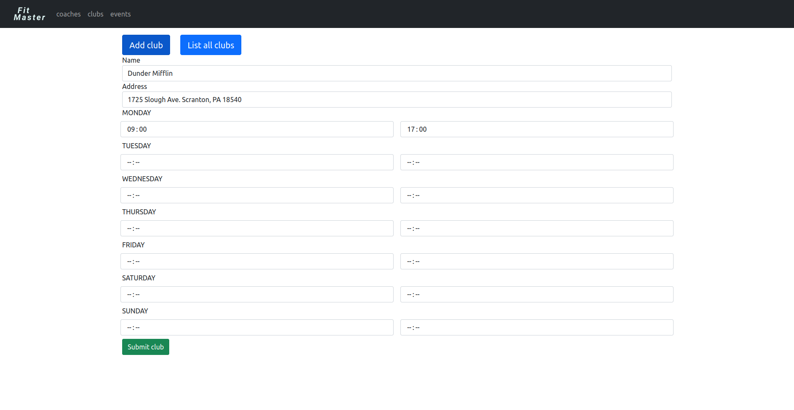
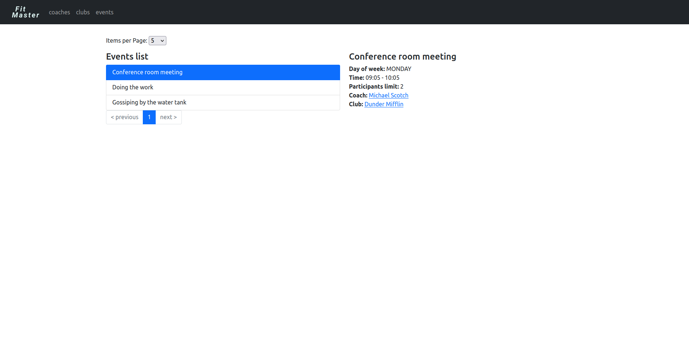
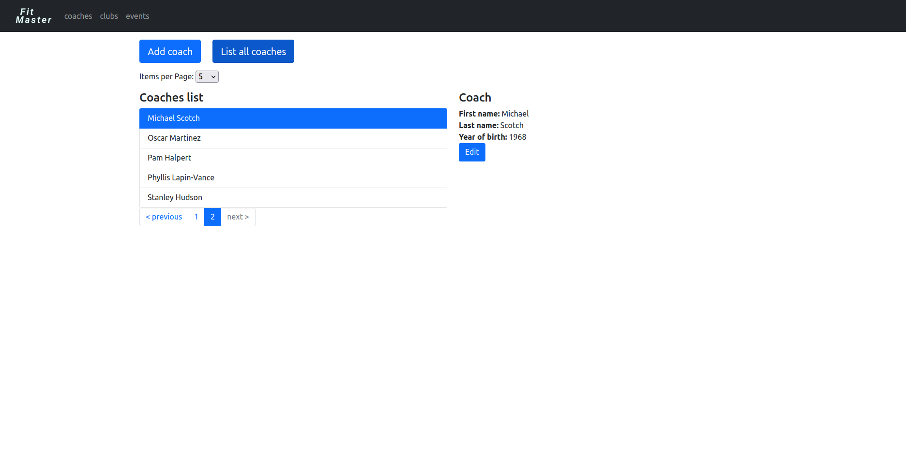

# FitMaster

FitMaster is a web React application connected to a backend server made in Java.
Its purpose is to make easier running a complex fitness place.

## Description

This project was originally created as a collaborative backend project
between [@KaHarlacz](https://github.com/KaHarlacz) and [@pfaron](https://github.com/pfaron).
Later on the project was extended and frontend was added by [@pfaron](https://github.com/pfaron).

### Purpose

The purpose of this application was to learn the best practices of web application creation.

### Features

* API designed with good REST practices in mind
* Controller-Service-Repository pattern
* Usage of DTO and Data classes
* Tree-like hierarchy structure of components
* SOLID principles

### Technologies

Backend:
* Java 17
* Spring Boot 2
* Lombok
* Hibernate
* FlyWay
* OpenAPI 3 / Swagger
* Gradle
* Docker
* GitLab CI/CD
* Logger
* JUnit
* Mockito

Frontend:
* Functional React
* Bootstrap 5
* Axios
* React Router
* React Paginate
* React Hooks

### Screenshots

